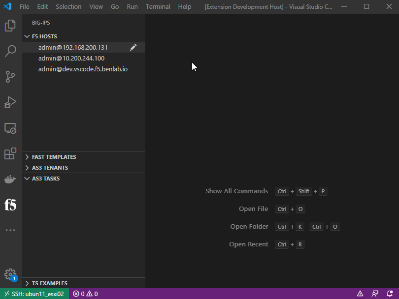
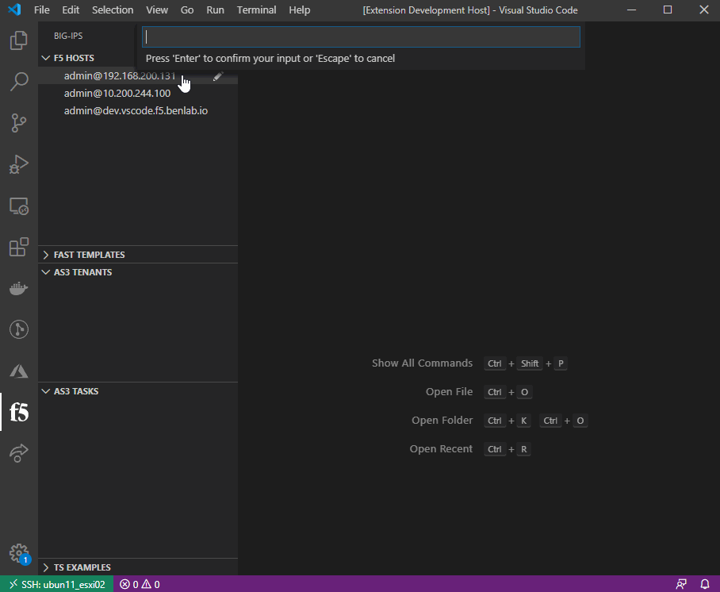
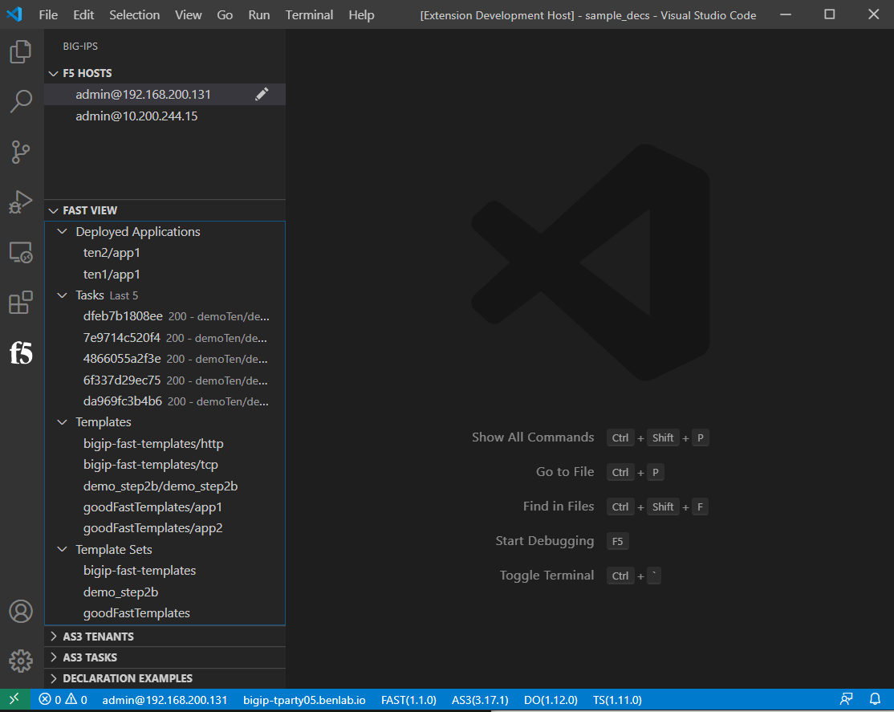
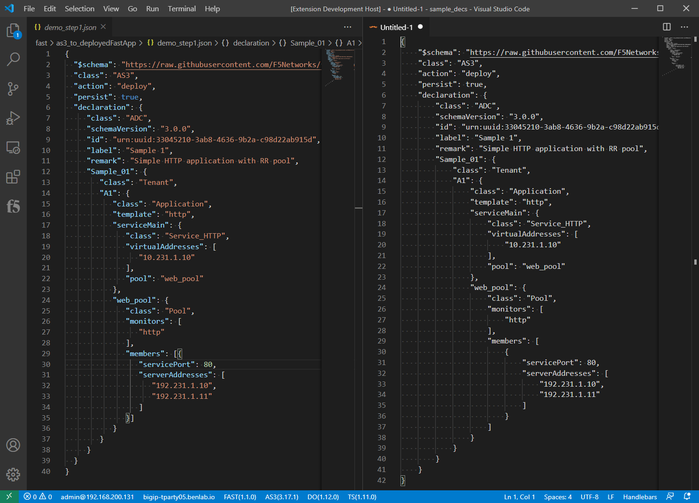
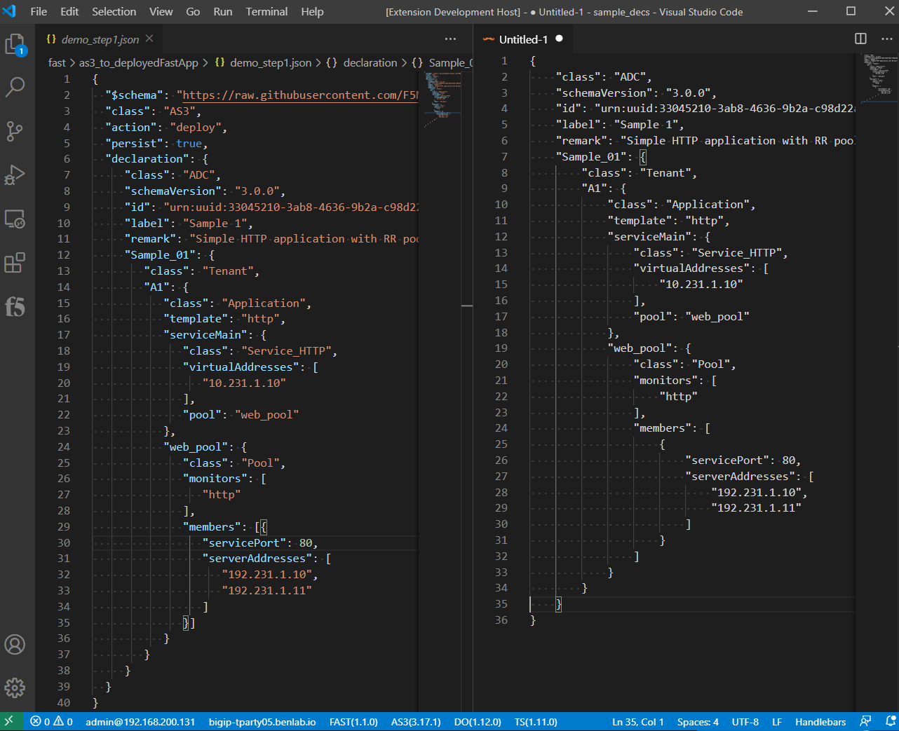
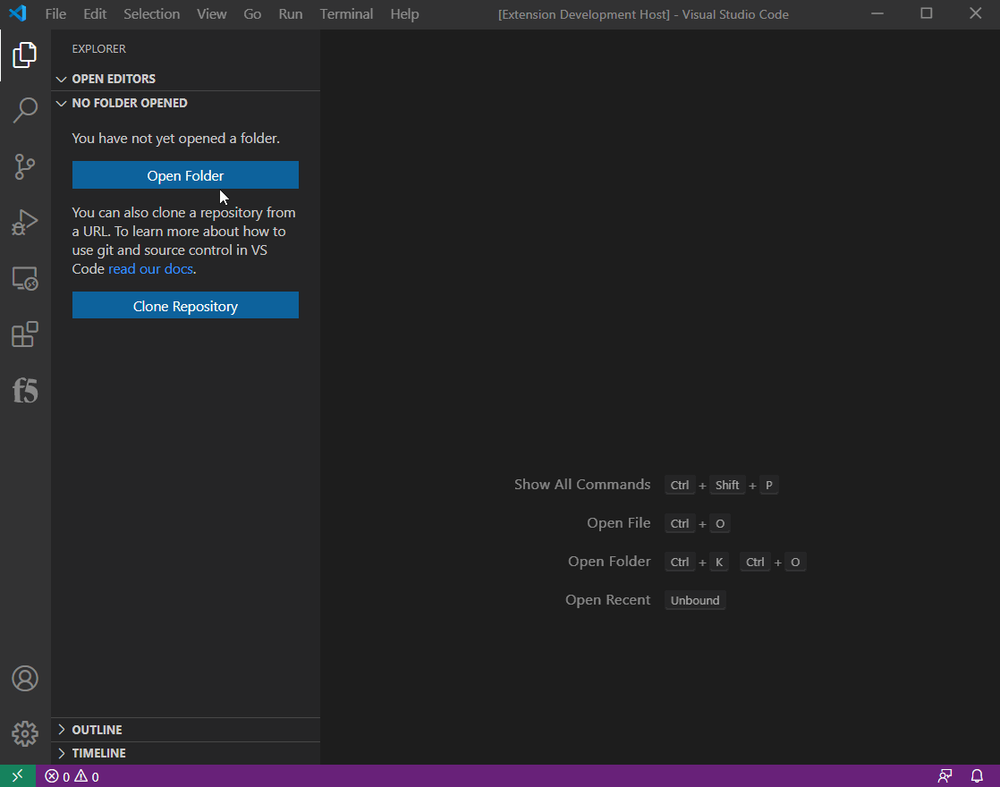
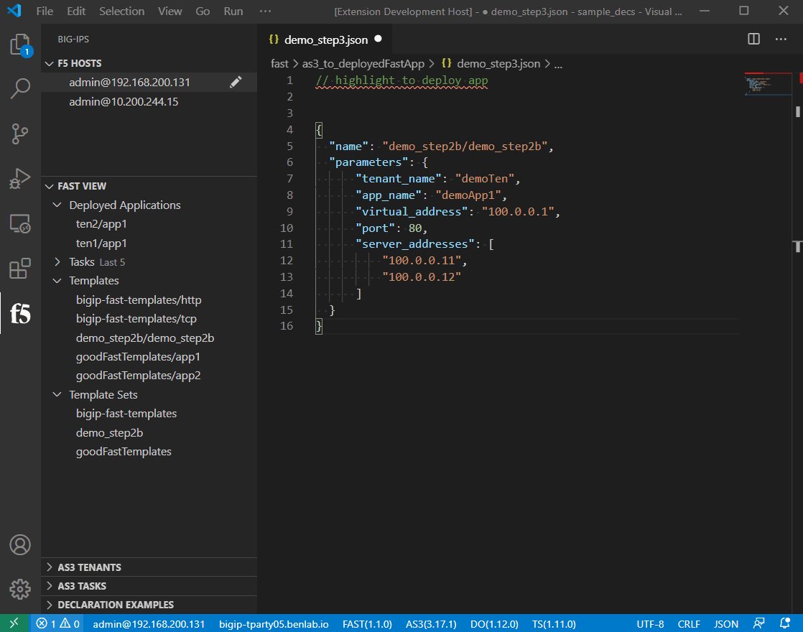
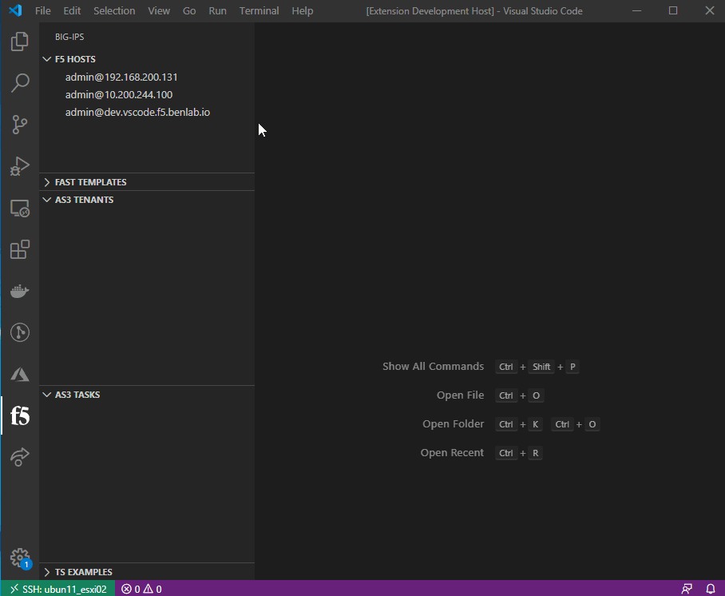
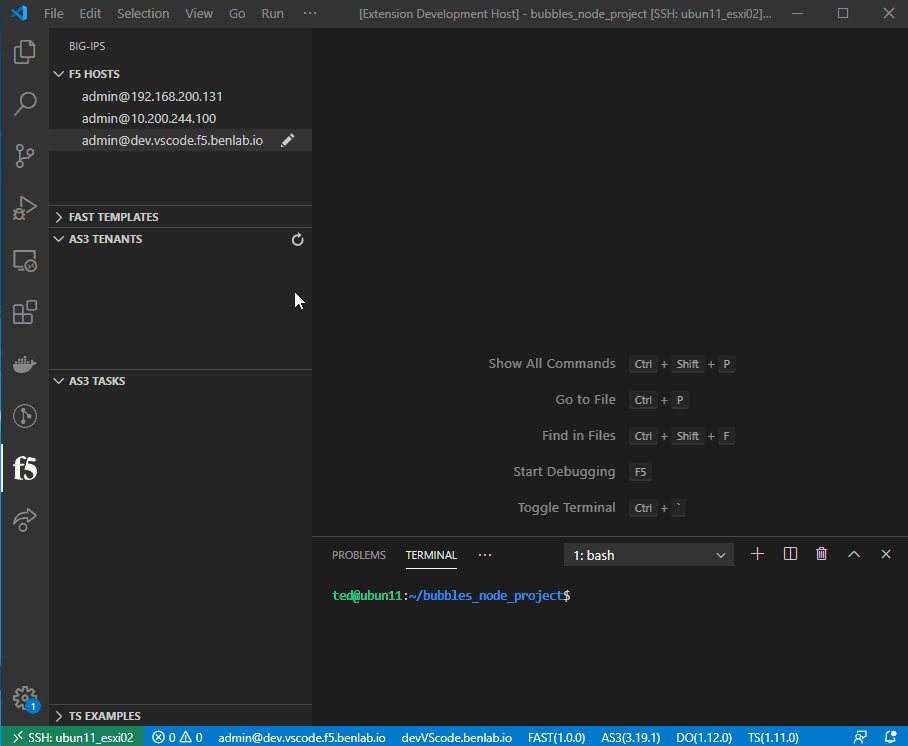

# vscode-f5-fast README

This is the README for the F5 (A)pplication (S)ervices (T)emplates(FAST), "vscode-f5-fast". 

This extension is intented to help interface with the F5 (A)utomated (T)ool(C)ain extensions, including FAST to manage templates/declarations.

This extension typically works with any F5 product running tmos and/or any of the primary ILX extensions(AS3/DO/TS), including BIG-IQ.

Any comments, questions or feature requests, please open a github repository issue


### Download via the Microsoft extension marketplace or directly from within VSCode
> https://marketplace.visualstudio.com/items?itemName=DumpySquare.vscode-f5-fast


---

## Index

* [CHANGELOG](CHANGELOG.md)
* [Research](./README_docs/research.md)
* [Writing ATC declarations in YAML!!!](./README_docs/jsonSchemaInYaml.md)
* [Crafting raw API calls](./README_docs/rawApiCalls.md)
* [ATC ILX rpm package management](./README_docs/rpmMgmt.md)
* [FAST information and How-To's](./README_docs/fast.md)
* [Additional Tools](./README_docs/tools.md)


Future extension features and enhancements have been moved to the repo issues(enhancements) for better tracking
* [repo issues and enhancements](https://github.com/DumpySquare/vscode-f5-fast/issues)

---

## Extension Commands

Extension commands are access through the command palette by pressing `F1` or `cntrl+shift+p`

This extension provides the following commands and are active on workspace load (if extension is installed and enabled).

* `F5: Connect to Device`: Used to select a device from list to connect to
* `F5: Disconnect`: Disconnect from current device
* `F5: Disconnect and Clear All Passwords`: Disconnect from current device and clear ALL cached passwords
* `F5: Show Device Info`: Displays json output of F5 Host information, including platform/licensing/software/macAddresses/vlans
* `F5: Add Host`: Prompts to add a new host to the configured list
* `F5: Remote Command Execute`: Prompts for command to execute on device via BASH API (account must have advanced shell enabled)
* `F5: Settings`: Opens VS Code settings window focused on F5-Fast settings (currently only device list)

* `F5-Fast: Show Info`: Displays json output of F5-Fast service info
* `F5-Fast: Deploy Fast App`: Post editor or text selection as FAST application deployment parameters
* `F5-Fast: Convert json as3 to mst for templating`: Takes an as3 json file type and changes it to .mst file type for templating
* `F5-Fast: Post Template`: Posts current editor or text selection as a new single FAST template
* `F5-Fast: Post Template Set`: Posts folder/templates as a Fast template set
* `F5-Fast: Render HTML Preview`: Takes current editor or text selection and provide FAST HTML gui parameters preview

* `F5-AS3: Post Declaration`: Post entire active editor selected contents as AS3 declaration to selected device (can also select/highlight text)

* `F5-DO: Inspect`: Displays json output of the DO 'inspect' endpoint
* `F5-DO: Get Current Declaration`: Displays json output of the current declaration, if there is one
* `F5-DO: Get Tasks`: Displays json output of the task history
* `F5-DO: Post Declaration`: Post entire active editor contents as DO declaration to selected device (can also select/highlight text to be sent)

* `F5-TS: Show Info`: Displays json output of TS service info
* `F5-TS: Get Current Declaration`: Displays json output of the current declaration, if there is one
* `F5-TS: Post Declaration`: Post entire active editor contents as TS declaration to selected device (can also select/highlight text to be send)


* `F5: ChuckJoke`: When you need some inspiration...

---

# How To's

## Basic device management (add/edit/delete, connect/disconnect)

- To add a device
  - Add under the vscode extension settings
    - Press `F1`, type `f5`, select "F5: Settings", click add item button
        -- or --
  - Add device from the F5 HOSTS view
    - Click `F5: Add HOST` button in top right of the extension view for "F5 HOSTS"

- To Modify a device:
  - Modify under the vscode extension settings
    - Press `F1`, type `f5`, select "F5: Settings", click pencil icon next to item to modify
        -- or --
  - Modify device from the F5 HOSTS view
    - Click the pencil icon on the right of the host entry in the "F5 HOSTS" view

- To Delete a device:
  - Delete under the vscode extension settings
    - Press `F1`, type `f5`, select "F5: Settings", click "X" icon next to item to delete
        -- or --
  - Delete device from the F5 HOSTS view
    - 'Right-Click`, select "DELETE" from the menu that appears next to the host entry in the "F5 HOSTS" view

## Device Mgmt (add, modify, delete devices)


---

## Connecting/Disconnecting and password caching

Connect means to select a device to work with.  When connected, commands/api calls will be executed on that device.

Passwords are cached automatically.  They can be cleared with the "F5: Disconnect and Clear ALL Passwords"

No need to disconnect when switching devices

If authentication to a device ever failes (401 response), password cache for that device will be cleared and prompt for a new one

*** passwords are cached using system encryption with KeyTar ***

- To connect to a device:
  - Select the device in the 'F5 Hosts' view on the left
    - -- or --
  - Press `F1`, type `f5`, select "F5: Connect to Device", select device from prompt

- To Disconnect from a device:
  - Click on the user@device object in the status bar at the bottom
    -  -- or --
  - Press `F1`, type `f5`, select "F5: Disconnect from Device"




---

## FAST Management

FAST view on the left will display applications deployed with device fast service, last five FAST tasks executed, templates and template sets



### How to create FAST template from AS3 declaration

Open an as3 declaration, then open command palette with `F1`, and select `F5-Fast: Convert json as3 to mst for templating`, this should open a new tab with the same declaration but in a "handlbars" language.



Next remove the AS3 class components. FAST will handle the as3 declaration components.



Then parameterize the declaration


### Uploading a single template

Open an mst/template.

Post template to fast engine via the command palette:  press `F1`, then filter/select `F5-Fast: Post mst as new fast template`.  Change the folder name if needed, provide a template name.

```
NOTE:  Uploading a single template to an existing folder overwrites other templates.  
        The single template method is primarily for testing.  
        It is recommended to upload template sets
```

### Uploading a template set

Template sets are the recommended method for long term template authoring and mgmt.  It is recommended to have a folder with different folders for the different template sets you may be creating.  

*** example layout ***
- main_templates_folder
  - prod_templates
  - qa_templates
  - dev_templates
  - infra_templates

*** example directory structure ***
- sample_decs
  - app1Templates
  - app2Templates
  - goodFastTemplates

Press `F1`, then filter/select `F5-Fast: Post Template Set`

If multiple workspaces are open, it will ask to select a workspace

Within the workspace, it will list all the first level folders, select the folder of Fast templates to upload

>All files in the selected fast template folder must be valid templates.  
>Each template is validated before all of them are zipped and uploaded/installed to the selected device with fast service

* example of opening a workspace, then connecting to f5 with fast, and uploading folder of templates as a template set *



### Deploying an application through FAST

To deploy an application with FAST, utilize the followin structure

The name should reference the fast folder/template to deploy, while the parameters object should contain all the necessary paramters to deploy the template

Press `F1`, then filter/select `F5-Fast: Deploy Fast App`

```
{
  "name": "demo_step2b/demo_step2b",
  "parameters": {
      "tenant_name": "demoTen",
      "app_name": "demoApp1",
      "virtual_address": "100.0.0.1",
      "port": 80,
      "server_addresses": [
          "100.0.0.11",
          "100.0.0.12"
      ]
  }
}
```


### Delete Fast application

Find the deployed application in the Fast view under "Deployed Applications", right click on the app, then select `Delete Fast App`


--- 

## AS3 Management (get/post/delete/tenants/tasks)

Once a device is connected, and the extension detects that AS3 is installed, a status bar will show up on the bottom indicating the running AS3 service verson.  

The AS3 Tenant TreeView on the left shows AS3 tenants and apps for each tenant.  Select a tenant to see all the app configuration details for that tenant.  You cannot select individual apps from the tree, they are just there for visibility

The AS3 Tasks TreeVew on the left is just to provide some visibility into the tasks/jobs that the AS3 service has run. 

To post an AS3 declaration, select the command from the palette by pressing `F1`.  You may need to search for 'as3' or 'f5'.

Select the declaration text to send or it will capture the entire editor window

To delete a tenant, right click the tenant in the AS3 Tenant TreeView on the left and select "Delete"



---

## DO Management (get/post)

If the extension detects the DO is running, a status bar will show up on the bottom showing the running service software version

Select the status bar item to see the current DO declaration 

Select the command from the palette drop down to post a declaration


---

## TS Management (get/post/clear)

If the extension detects the TS is running, a status bar will show up on the bottom showing the running service software version

Select the status bar item to see the current TS declaration 

Select the command from the palette drop down to post a declaration



---

## Remote Command Execute

Command to issue on the remote device.  Good for quickly getting information while building declarations!


---

## Extension Settings

This extension contributes the following settings:

* `f5.hosts`: a list of f5 devices to connect to


## Known Issues

HTTP/422 responses - Can happen for a handful of reasons:
- Getting DO declaration when device has settings DO can configure but device was not deployed with DO (it can't manage the settings that are already there)
- Improperly formatted/wrong declaration
  - Sometimes this is from the '$schema' reference in the declaration
- Sometimes you can fix a DO HTTP/400 response by overwriting with a clean/updated declaration

### HTTP Auth Failures

When utilizing an external auth provider, occasionally restjavad/restnoded can have some issues, resulting in some occansional HTTP/400 auth errors:

The fix is to restart: restjavad and restnoded

Error from extension
> HTTP Auth FAILURE: 400 - undefined

Error from restjavad log
```
[SEVERE][6859][24 Jul 2020 13:11:39 UTC][8100/shared/authn/login AuthnWorker] Error as the maximum time to wait exceeded while getting value of loginProviderName
[SEVERE][6860][24 Jul 2020 13:11:39 UTC][8100/shared/authn/login AuthnWorker] Error while setting value to loginProviderName when no loginReference and no loginProviderName were given
[WARNING][6861][24 Jul 2020 13:11:39 UTC][com.f5.rest.common.RestWorker] dispatch to worker http://localhost:8100/shared/authn/login caught following exception: java.lang.NullPointerException
        at com.f5.rest.workers.authn.AuthnWorker.onPost(AuthnWorker.java:394)
        at com.f5.rest.common.RestWorker.callDerivedRestMethod(RestWorker.java:1276)
        at com.f5.rest.common.RestWorker.callRestMethodHandler(RestWorker.java:1190)
        at com.f5.rest.common.RestServer.processQueuedRequests(RestServer.java:1207)
        at com.f5.rest.common.RestServer.access$000(RestServer.java:44)
        at com.f5.rest.common.RestServer$1.run(RestServer.java:285)
        at java.util.concurrent.Executors$RunnableAdapter.call(Executors.java:473)
        at java.util.concurrent.FutureTask.run(FutureTask.java:262)
        at java.util.concurrent.ScheduledThreadPoolExecutor$ScheduledFutureTask.access$201(ScheduledThreadPoolExecutor.java:178)
        at java.util.concurrent.ScheduledThreadPoolExecutor$ScheduledFutureTask.run(ScheduledThreadPoolExecutor.java:292)
        at java.util.concurrent.ThreadPoolExecutor.runWorker(ThreadPoolExecutor.java:1152)
        at java.util.concurrent.ThreadPoolExecutor$Worker.run(ThreadPoolExecutor.java:622)
        at java.lang.Thread.run(Thread.java:748)
```

---

## Client side extension debugging

VScode has a built in debugger very much like Chrome.  This can be used to gain insight to what is happening when things don't respond as expected.

If you are having issues, it may be best to start here and capture the output as described below:

- In the main VSCode window, along the top, select **Help**, then **Toggle Developer Tools**, select the **Console** tab.
  - Then, explore the requests and responses to see if there are any areas of concern
    - Expand some of the objects by clicking the little triangle next to the obejct under a request or response to inspect

If needed, **right-click** on an entry, then select **save-as** to save the log including expanded objects to a file.  This can be used for troubleshooting


## installing vsix 

The recommended way to get this extension is to install from the Microsoft VScode extension marketplace or from within VSCode directly, under the extensions activity bar view on the left.

If you still need to install from vsix, they can be downloaded under the 'release' tab above: https://github.com/DumpySquare/vscode-f5-fast/releases

Different ways to install vsix:
- https://code.visualstudio.com/docs/editor/extension-gallery#_install-from-a-vsix
- https://github.com/eamodio/vscode-gitlens/wiki/Installing-Prereleases-(vsix)


## Running the extension for dev

- Clone and install dependencies:
    ```bash
    git clone https://github.com/DumpySquare/vscode-f5-fast.git
    cd cd vscode-f5-fast/
    npm install
    code .
    ```
- Start Debugging environment: Keystroke `F5`
- Navigate to view container by clicking on the f5 icon in the Activity bar (typically on the left)
- Update device list in tree view on the left with a device in your environment
  - ***ADD*** in the ***F5 Hosts*** view
  - or `click` the pencil icon on an item and modify the item
- Connect to device
  - (`click` device in host tree or `Cntrl+shift+P` or `F1`)
