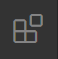
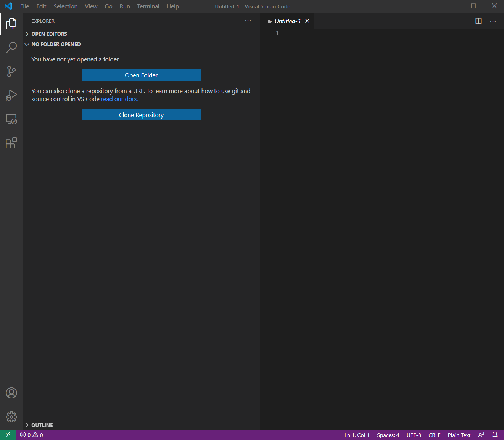
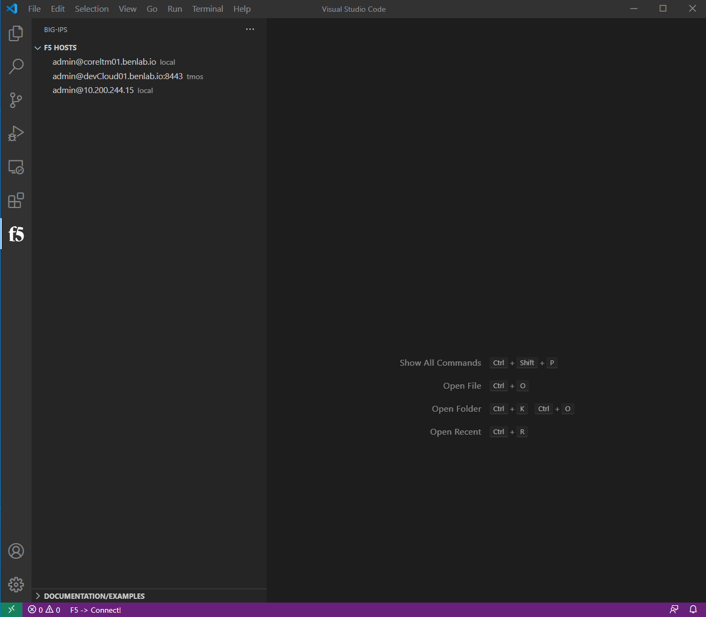
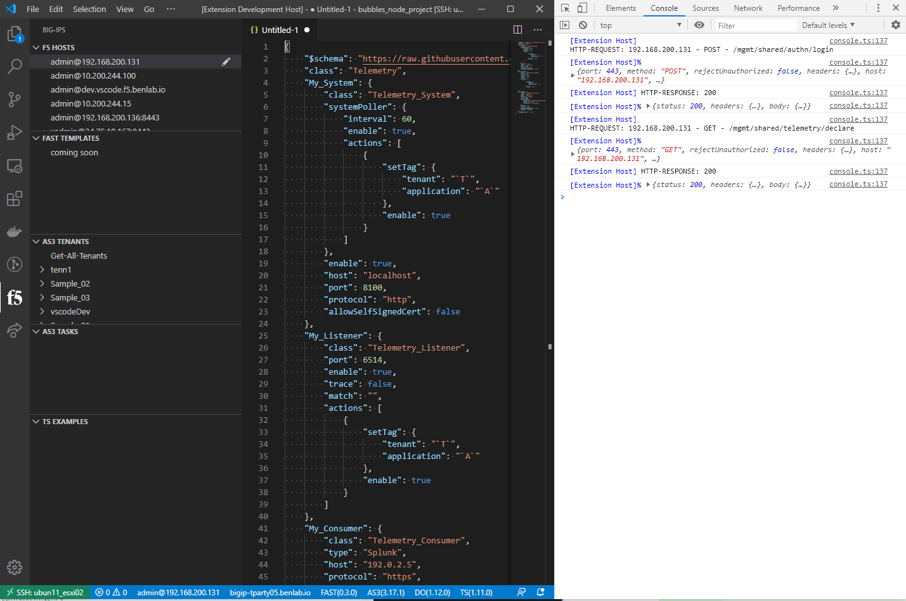

# The F5 VSCode Extension

Let the F5 VSCode Extension supercharge your abilities to write (A)utomated (T)ool(C)hain declarations with snippets, examples and declaration schema validation, and also assist with connecting, deploying, retrieving and updating declarations on F5 devices.

It can also help with iRules/iApps, BIG-IQ, and regular configuration/migration.

- GET/POST/DELETE of all ATC services, including FAST/AS3/DO/TS/CF
- links to quickly open related ATC documentation
- Direct access to ATC examples from git repo
- Install/UnInstall of ATC rpms
- Convert JSON <-> YAML
- Hovers to view decoded information for (certificates/base64)
- Extract TMOS applications (per virtual server)
- Write, deploy and modify iRules/iApps (with vscode-irule extension for language support)

!> Any comments, questions or feature requests, please open an issue!

## Documentation site

> <https://f5devcentral.github.io/vscode-f5/#/>

## Getting the extension

The best path is to install Visual Studio Code from: <https://code.visualstudio.com/>

## VSCode Marketplace

- <https://marketplace.visualstudio.com/items?itemName=F5DevCentral.vscode-f5>

## Open Source Marketplace

- <https://open-vsx.org/extension/F5DevCentral/vscode-f5>

Then install the extension following the steps below:

Select the extensions view 



Search for `F5`, select the extension "The F5 Extension", then `Install`



## Create a device and connect

Select `Add Host` in the `F5: Hosts` view.  Then type in device details in the \<user\>@x.x.x.x format, hit `Enter` to submit



## Deploy example as3 app

Click on the hostname of the connected device at the bottom of the window.

> This is the easiest way to get an editor window for JSON files and it also demontrates how to get device details

Now that we have a json editor, select all text (`control + a`), then `delete`.

Type `as3` to get the example AS3 snippet, press `Enter`.

This should insert a sample AS3 declaration into the editor

> Note the declaration schema reference at the top.  This provides instant feedback and validation for any necssary modifications.  Please see [Schema Validation](schema_validation.md) for more details

Right-click in the editor and select `POST as AS3 Declaration`.  This should post the declaration to the currently connected device

!> Please be sure to have the AS3 service installed prior.  See [ATC RPM Mgmt](atc_rpm_mgmt.md) for assistance with getting a service installed


---

### To delete deployed AS3 tenant from device

Right-click on the tenant in the AS3 view on the left, then select `Delete Tenant`

## Known Issues

HTTP/422 responses - Can happen for a handful of reasons:
- Getting DO declaration when device has settings DO can configure but device was not deployed with DO (it can't manage the settings that are already there)
- Improperly formatted/wrong declaration
  - Sometimes this is from the '$schema' reference in the declaration
- Sometimes you can fix a DO HTTP/400 response by overwriting with a clean/updated declaration


### HTTP Auth Failures

When utilizing an external auth provider, occasionally restjavad/restnoded can have some issues, resulting in some occansional HTTP/400 auth errors:

The fix is to restart: restjavad and restnoded

Error from extension
> HTTP Auth FAILURE: 400 - undefined

Error from restjavad log

```log
[SEVERE][6859][24 Jul 2020 13:11:39 UTC][8100/shared/authn/login AuthnWorker] Error as the maximum time to wait exceeded while getting value of loginProviderName
[SEVERE][6860][24 Jul 2020 13:11:39 UTC][8100/shared/authn/login AuthnWorker] Error while setting value to loginProviderName when no loginReference and no loginProviderName were given
[WARNING][6861][24 Jul 2020 13:11:39 UTC][com.f5.rest.common.RestWorker] dispatch to worker http://localhost:8100/shared/authn/login caught following exception: java.lang.NullPointerException
        at com.f5.rest.workers.authn.AuthnWorker.onPost(AuthnWorker.java:394)
        at com.f5.rest.common.RestWorker.callDerivedRestMethod(RestWorker.java:1276)
        at com.f5.rest.common.RestWorker.callRestMethodHandler(RestWorker.java:1190)
        at com.f5.rest.common.RestServer.processQueuedRequests(RestServer.java:1207)
        at com.f5.rest.common.RestServer.access$000(RestServer.java:44)
        at com.f5.rest.common.RestServer$1.run(RestServer.java:285)
        at java.util.concurrent.Executors$RunnableAdapter.call(Executors.java:473)
        at java.util.concurrent.FutureTask.run(FutureTask.java:262)
        at java.util.concurrent.ScheduledThreadPoolExecutor$ScheduledFutureTask.access$201(ScheduledThreadPoolExecutor.java:178)
        at java.util.concurrent.ScheduledThreadPoolExecutor$ScheduledFutureTask.run(ScheduledThreadPoolExecutor.java:292)
        at java.util.concurrent.ThreadPoolExecutor.runWorker(ThreadPoolExecutor.java:1152)
        at java.util.concurrent.ThreadPoolExecutor$Worker.run(ThreadPoolExecutor.java:622)
        at java.lang.Thread.run(Thread.java:748)
```

---

## Client side extension debugging

### Developer Debugger

VScode has a built in debugger very much like Chrome.  This can be used to gain insight to what is happening when things don't respond as expected.

If you are having issues, it may be best to start here and capture the output as described below:

- In the main VSCode window, along the top, select **Help**, then **Toggle Developer Tools**, select the **Console** tab.
  - Then, explore the requests and responses to see if there are any areas of concern
    - Expand some of the objects by clicking the little triangle next to the obejct under a request or response to inspect

If needed, **right-click** on an entry, then select **save-as** to save the log including expanded objects to a file.  This can be used for troubleshooting

<!--  -->


This mainly catches logs send through the console.log(''), which should typically be for development.


## installing vsix

The recommended way to get this extension is to install from the Microsoft VScode extension marketplace or from within VSCode directly, under the extensions activity bar view on the left.

If you still need to install from vsix, they can be downloaded under the 'release' tab above: <https://github.com/f5devcentral/vscode-f5/releases>

Different ways to install vsix:

- https://code.visualstudio.com/docs/editor/extension-gallery#_install-from-a-vsix
- <https://github.com/eamodio/vscode-gitlens/wiki/Installing-Prereleases-(vsix>)


## Running the extension for dev

- Clone and install dependencies:

    ```bash
    git clone https://github.com/f5devcentral/vscode-f5.git
    cd vscode-f5-fast/
    npm install
    code .
    ```

- Start Debugging environment: Keystroke `F5`
- Navigate to view container by clicking on the f5 icon in the Activity bar (typically on the left)
- Update device list in tree view on the left with a device in your environment
  - ***ADD*** in the ***F5 Hosts*** view
  - or `click` the pencil icon on an item and modify the item
- Connect to device
  - (`click` device in host tree or `Cntrl+shift+P` or `F1`)
