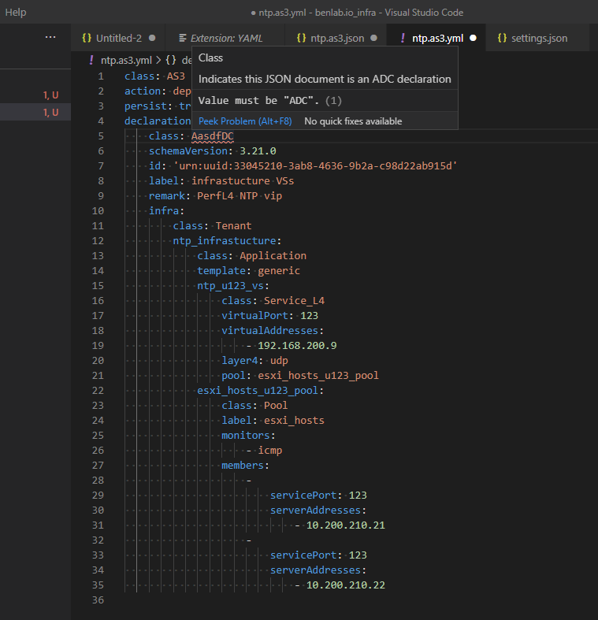

# Research

[BACK TO MAIN README](../README.md)

---
## Validating YAML with JSON Schemas

### WRITE ATC DECLARATIONS IN YAML!!!


Install the RedHat YAML extension
https://marketplace.visualstudio.com/items?itemName=redhat.vscode-yaml


In the vscode settings for that extension:
```
    "yaml.schemas": {
        "https://raw.githubusercontent.com/F5Networks/f5-appsvcs-extension/master/schema/latest/as3-schema.json": ["*.as3.yml"],
        "https://raw.githubusercontent.com/F5Networks/f5-declarative-onboarding/master/src/schema/latest/base.schema.json": ["*.do.yml"],
        "https://raw.githubusercontent.com/F5Networks/f5-telemetry-streaming/master/src/schema/latest/base_schema.json": ["*.ts.*"],
    }
```

create a yaml file for as3 like: `as3Dec1.as3.yml `


