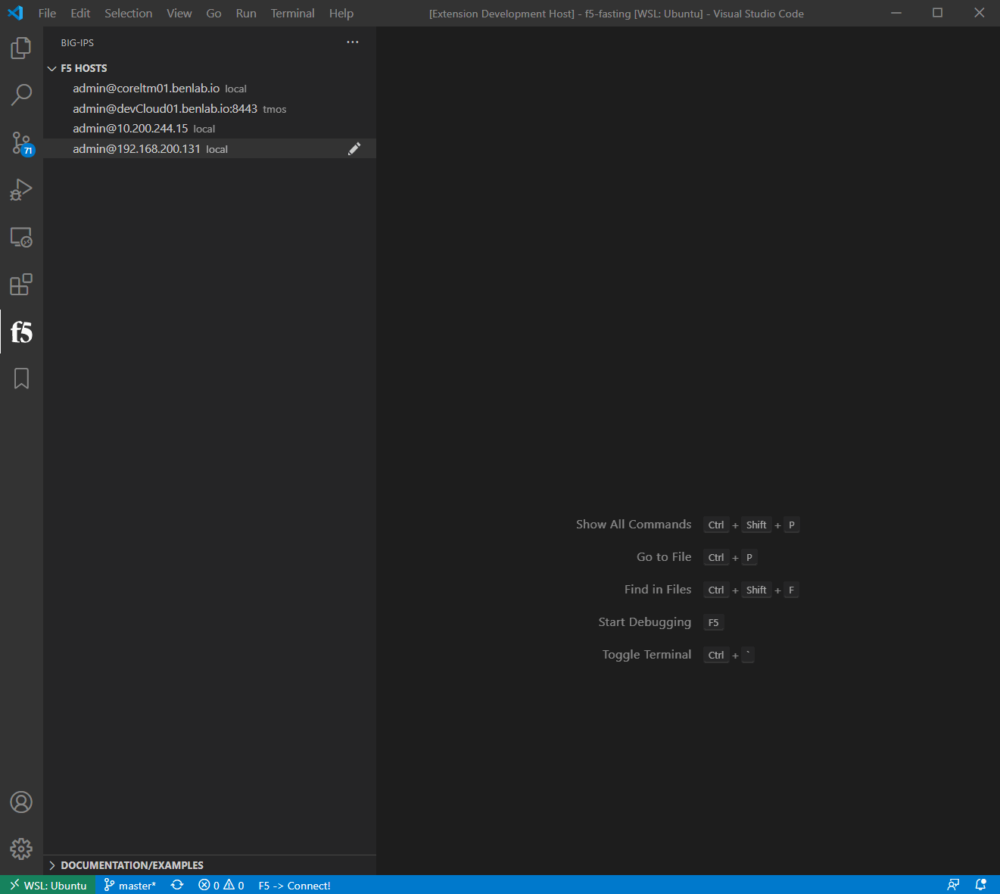

# ATC ILX RPM MANAGEMENT

The extension can install and un-install ILX rpms on the connected device

## Commands

* `F5: Install/Update RPM`: Installs selected ATC and version
    - Updating an existing rpm to a newer version "should" work but hasn't been thoroughly tested
    - Provides a list of ATC tools to install (FAST, AS3, DO, TS)
        - When ATC service has been selected, a list of available version is presented
        - When a version is selected, the extension will check the local cache
            - if already downloaded, upload and install
            - if NOT already downloaded, then download from repo, upload to device, install
    - Also exposed as a right-click option in the explorer view
        - This allows the selection of local ILX RPMs that may be part of a repo

* `F5: Un-Install RPM`: Un-Installs selected rpm
    - Querys the device for currently installed rpm packages
    - On select, issues task to delete rpm install

>**Note:  the install/un-install task completes rather quickly but it can take another 20-60 seconds for restnoded/restjavad to complete the restart**

## Install

`F1`, then select `F5: Install RPM`, select the desired ATC service to install

Select the desired ATC RPM version

> ATC RPM/versions are queried directly from the respective github repos, so latest versions should be in this list as they are released.

> This process downloads the rpm to the local machine running VSCode (example path: C:\Users\ted\.vscode\extensions\f5devcentral.vscode-f5-2.8.1\atc_ilx_rpm_cache). If the selected version is found in the local cache, cache will be used instead of downloading the rpm every time.  Then the rpm is uploaded to the connected device and installed accordingly

> The `waiting for services to restart` is just a 30 second timer.  It doesn't actually monitor the services as they restart (RFE?).  So, it may be necessary to disconnect and re-connect to the device to get the statu bars at the bottom to update.

## Uninstall

`F1`, then select `F5: Un-Install RPM`, select the RPM to uninstall

