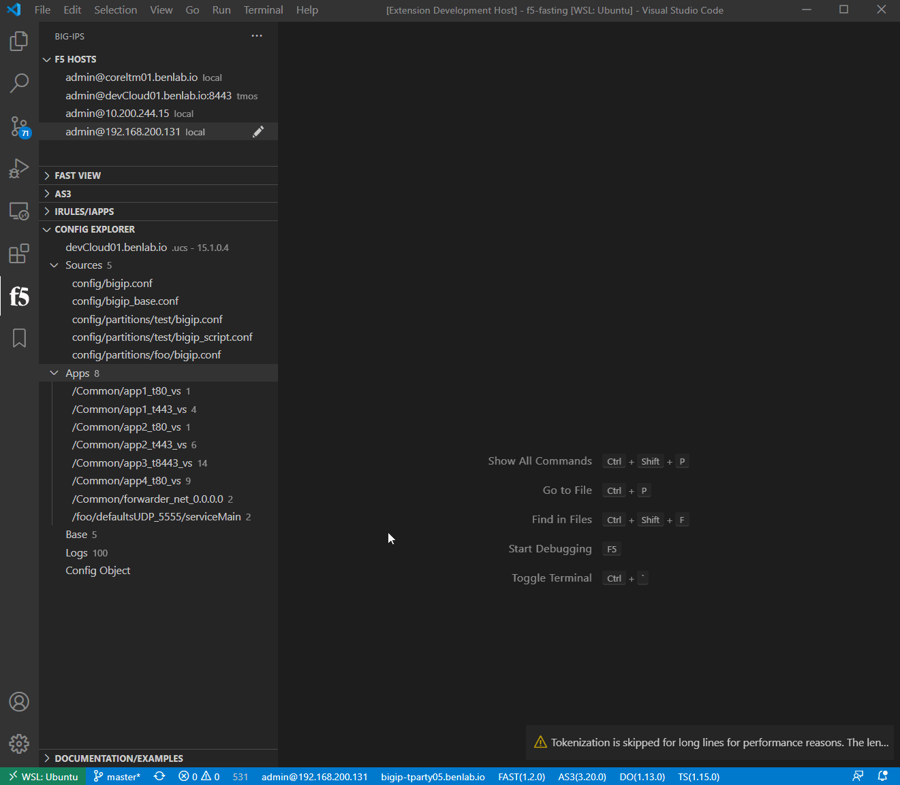
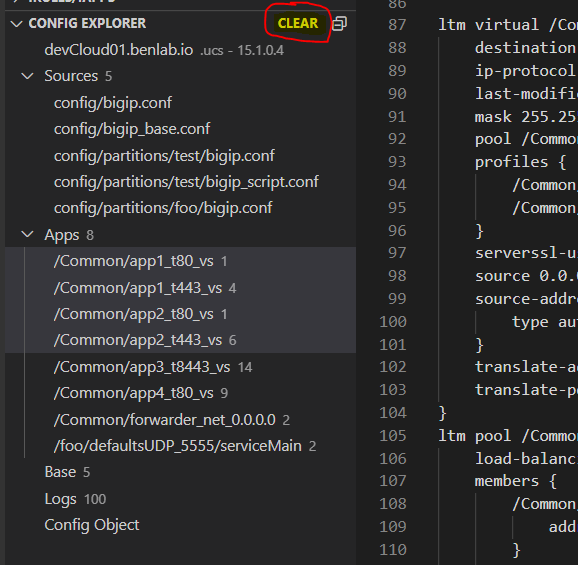

# Config Explorer

The configuration explorer is a tool that can take a bigip.conf, ucs, or qkview and provide configuration browsing, including extracted applications

!> application extraction is in it's early release phase and is based on most common profile options.  It is scoped to what is in the bigip.conf (and other partitions).  So, things like certificates are not included at this time.

> INSIDER:  The application discovery process does included attempting to discover pools referenced in iRules and Local Traffic Policies

## Local UCS/QKVIEW

By right-clicking on a ucs/qkview in the explorer view, the option to `Explore TMOS Config` should be available

## Connected Device

The explore config functionality can also be used on the currently connected device.

This is accessed by right-clicking on the device name and selecting `Explore Config`.

!> Must be connected to device first

This will produce the same `Config Explorer` view

> INSIDER:  This process creates a mini_ucs file that includes all config files (from all partitions), bigip_base.conf and bundles them as a mini_ucs like package

!> Some UCS/QKVIEWS/Configs can get very large.  Please be patient as these files are collected, unpacked and parsed.  The progress bar at the bottom should provide any change in status during processing

## Multi-App Select

Multiple apps can be selected to produce a single file.

To use multi-select, hold the `control` key while clicking on all the desired applications, then right-click `Show Apps` to produce a single file with the selected application configs

## Clearing Config Explorer Details

The explorer view details are only cleared when selecting the `CLEAR` button at the top of the view.

The allows for expanded possible workflows where details can be loaded via any method independent of connecting to a device and sending information

> example 1:  connect to a device, explore the config, then connect to another device and merge config object/applications with the newly connected device

> example 2:  load config from qkview, then merge an application with a connected device

