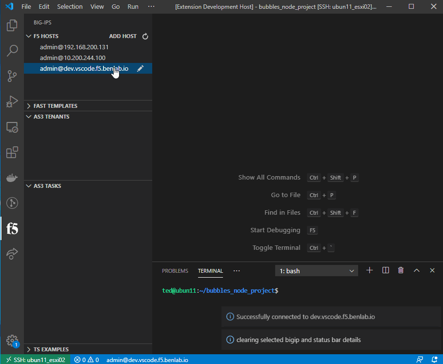

# DO/TS

---

## DO Management (get/post)

If the extension detects the DO is running, a status bar will show up on the bottom showing the running service software version

Select the status bar item to see the current DO declaration 

Select the command from the palette drop down to post a declaration

---

## TS Management (get/post/clear)

If the extension detects the TS is running, a status bar will show up on the bottom showing the running service software version

Select the status bar item to see the current TS declaration 

Select the command from the palette drop down to post a declaration

