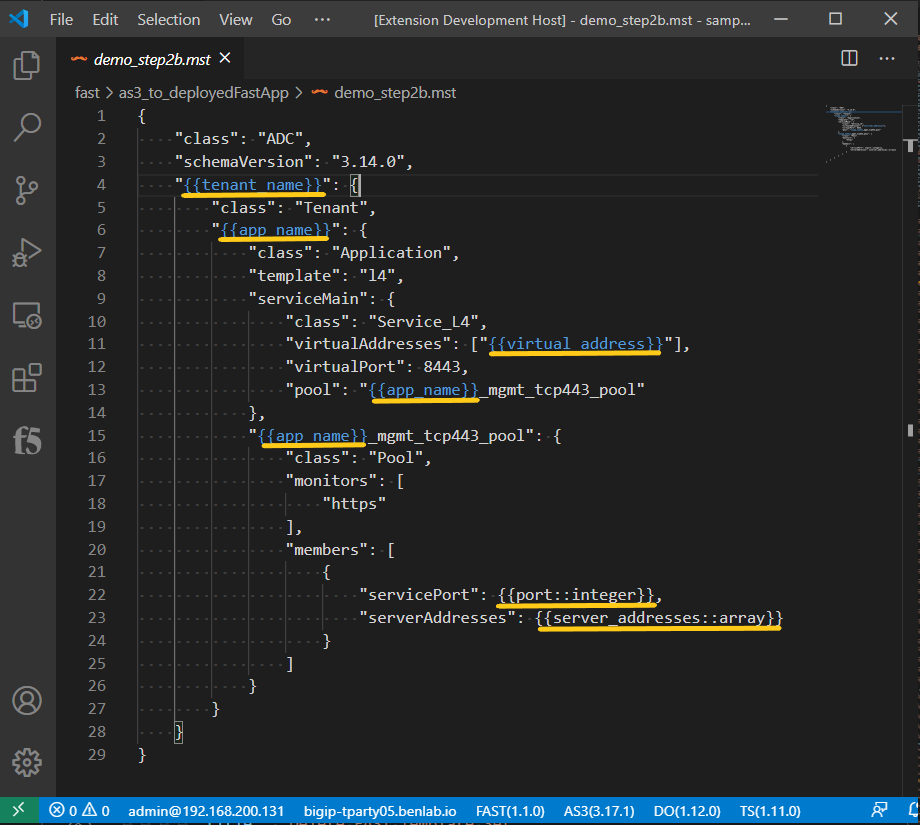

# FAST Management

FAST view on the left will display applications deployed with device fast service, last five FAST tasks executed, templates and template sets


## How to create FAST template from AS3 declaration (update)

Open an as3 declaration, then open command palette with `F1`, and select `F5-Fast: Convert json as3 to mst for templating`, this should open a new tab with the same declaration but in a "handlbars" language.


Next remove the AS3 class components. FAST will handle the as3 declaration components.


Then parameterize the declaration



## Uploading a single template

Open an mst/template.

Post template to fast engine via the command palette:  press `F1`, then filter/select `F5-Fast: Post mst as new fast template`.  Change the folder name if needed, provide a template name.

```
NOTE:  Uploading a single template to an existing folder overwrites other templates.  
        The single template method is primarily for testing.  
        It is recommended to upload template sets
```

## Uploading a template set

Template sets are the recommended method for long term template authoring and mgmt.  It is recommended to have a folder with different folders for the different template sets you may be creating.  

*** example layout ***
- main_templates_folder
  - prod_templates
  - qa_templates
  - dev_templates
  - infra_templates

*** example directory structure ***
- sample_decs
  - app1Templates
  - app2Templates
  - goodFastTemplates

Press `F1`, then filter/select `F5-Fast: Post Template Set`

If multiple workspaces are open, it will ask to select a workspace

Within the workspace, it will list all the first level folders, select the folder of Fast templates to upload

>All files in the selected fast template folder must be valid templates.  
>Each template is validated before all of them are zipped and uploaded/installed to the selected device with fast service

* example of opening a workspace, then connecting to f5 with fast, and uploading folder of templates as a template set *
<!--  -->


## Deploying an application through FAST

To deploy an application with FAST, utilize the followin structure

The name should reference the fast folder/template to deploy, while the parameters object should contain all the necessary paramters to deploy the template

Press `F1`, then filter/select `F5-Fast: Deploy Fast App`

```json
{
  "name": "demo_step2b/demo_step2b",
  "parameters": {
      "tenant_name": "demoTen",
      "app_name": "demoApp1",
      "virtual_address": "100.0.0.1",
      "port": 80,
      "server_addresses": [
          "100.0.0.11",
          "100.0.0.12"
      ]
  }
}
```


<!--  -->

## Delete Fast application

Find the deployed application in the Fast view under "Deployed Applications", right click on the app, then select `Delete Fast App`

<!--  -->


