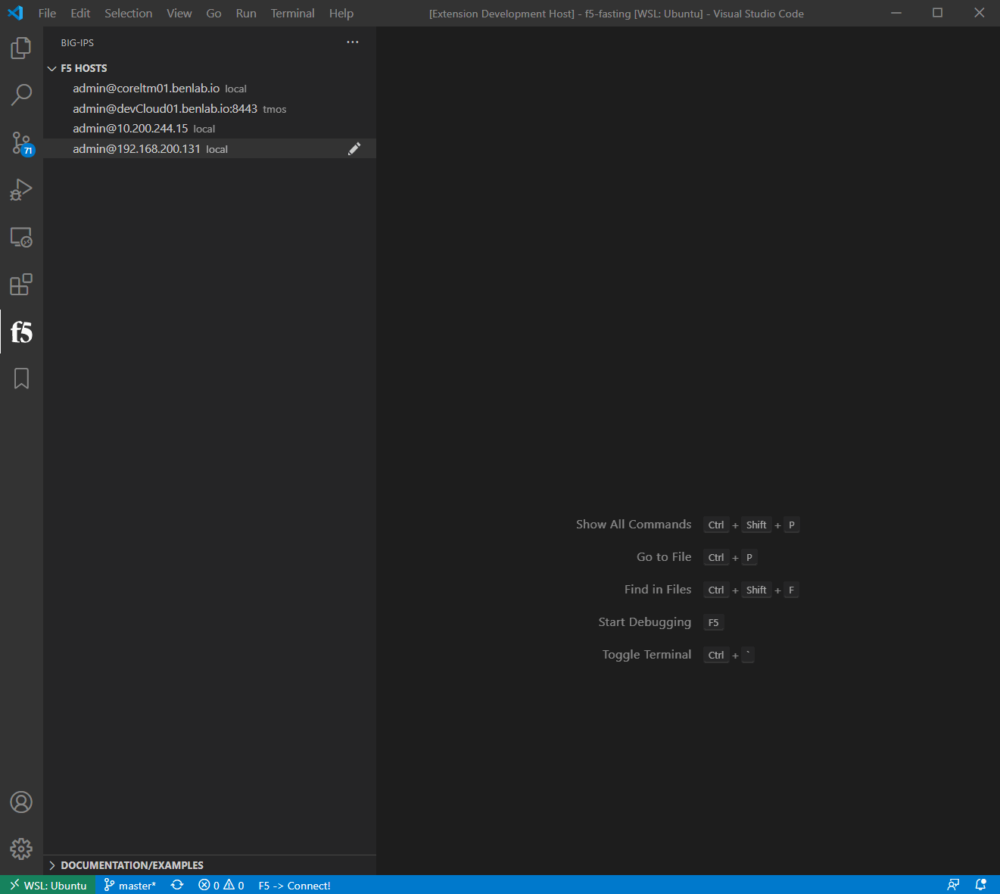
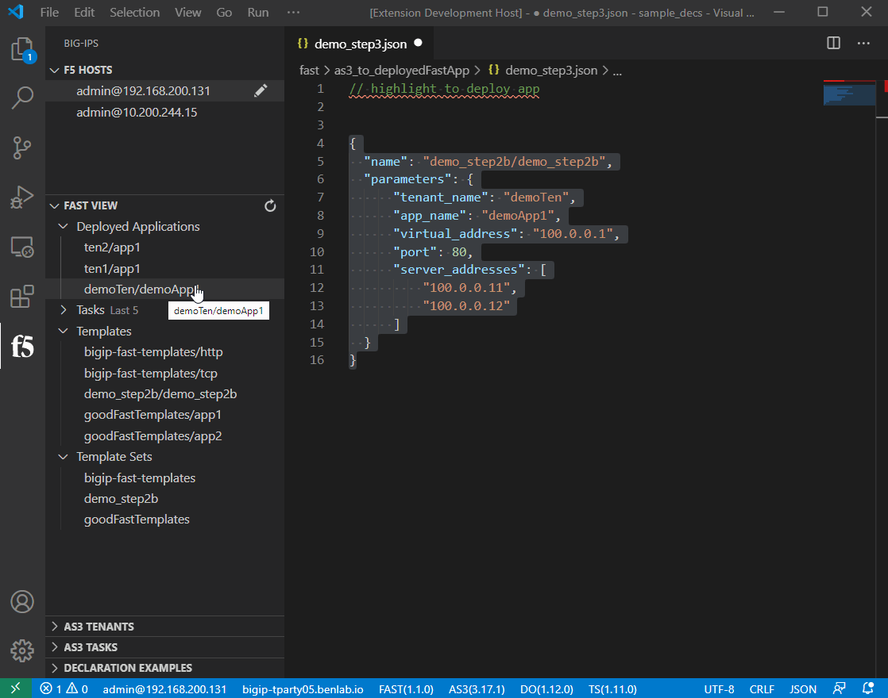

# FAST Management

FAST view on the left will display applications deployed with device fast service, last five FAST tasks executed, templates and template sets


## How to create FAST template from AS3 declaration

The following is an example FAST template in YAML form.  FAST accepts other template types, like .mst, but .yml is the recommended path since it provides the interface HTML paramters to make the template more consumable to the end users

!> Notice the `template` parameter is a regular AS3 declaration with the template variables `{{ tenant_name }}`

```yaml
title: Simple Application
description: Simple load balanced vs using the same port on client and server side.
template: |
  {
    "class": "ADC",
    "schemaVersion": "3.20.0",
    "{{tenant_name}}": {
      "class": "Tenant",
      "{{application_name}}": {
        "class": "Application",
        "template": "udp",
        "serviceMain": {
          "class": "Service_UDP",
          "virtualAddresses": [
            "{{virtual_address}}"
          ],
          "virtualPort": {{virtual_port::integer}},
          "pool": "{{application_name}}_Pool1"
        },
        "{{application_name}}_Pool1": {
          "class": "Pool",
          "monitors": [
            "icmp"
          ],
          "members": [
            {
              "serverAddresses": {{server_addresses::array}},
              "servicePort": {{service_port::integer}}
            }
          ]
        }
      }
    }
  }
  ```

## Previewing a FAST template

FAST templates have an HTML view for the UI.  It can be access through the extension for testing.

On a template from the `FAST VIEW` or template file in explorer, right-click, select `Render Fast Template HTML Preview`.

This will produce the final HTML view for the UI

At the bottom of the preview, the extension adds the `Render` button, which will render the output of the template

!> For the template preview to work, the template must not have any dependencies or referenced schemas as part of a 'template set'.  The template must be able to be validated on it's own as a single file


!> This workflow also ties into being able to post the fast template output to an AS3 service if the connected device is running one

## Uploading a single template

Open an mst/template.

Post template to fast engine via the command palette:  press `F1`, then filter/select `F5-Fast: Post mst as new fast template`.  Change the folder name if needed, provide a template name.

>NOTE:  Uploading a single template to an existing folder overwrites other templates. The single template method is primarily for testing.  It is recommended to upload template sets

## Uploading a template set

Template sets are the recommended method for long term template authoring and mgmt.  It is recommended to have a folder with different folders for the different template sets you may be creating.  

*** example layout ***
- main_templates_folder
  - prod_templates
  - qa_templates
  - dev_templates
  - infra_templates

*** example directory structure ***
- sample_decs
  - app1Templates
  - app2Templates
  - goodFastTemplates

Press `F1`, then filter/select `F5-Fast: Post Template Set`

!> this command is also found via righ click on folder or .yml/.yaml file in explorer view 

!>All files in the selected fast template folder must be valid templates.  

!>Each template is validated before all of them are zipped and uploaded/installed to the selected device with fast service

> Example of opening a workspace, then connecting to f5 with fast, and uploading folder of templates as a template set


## Uploading via right-click

The latest method to upload templates is with a simple right click from within the explorer view




## Deploying an application through FAST

To deploy an application with FAST, utilize the followin structure

The name should reference the fast folder/template to deploy, while the parameters object should contain all the necessary paramters to deploy the template

Press `F1`, then filter/select `F5-Fast: Deploy Fast App`

```json
{
  "name": "demo_step2b/demo_step2b",
  "parameters": {
      "tenant_name": "demoTen",
      "app_name": "demoApp1",
      "virtual_address": "100.0.0.1",
      "port": 80,
      "server_addresses": [
          "100.0.0.11",
          "100.0.0.12"
      ]
  }
}
```


## Delete Fast application

Find the deployed application in the Fast view under "Deployed Applications", right click on the app, then select `Delete Fast App`




