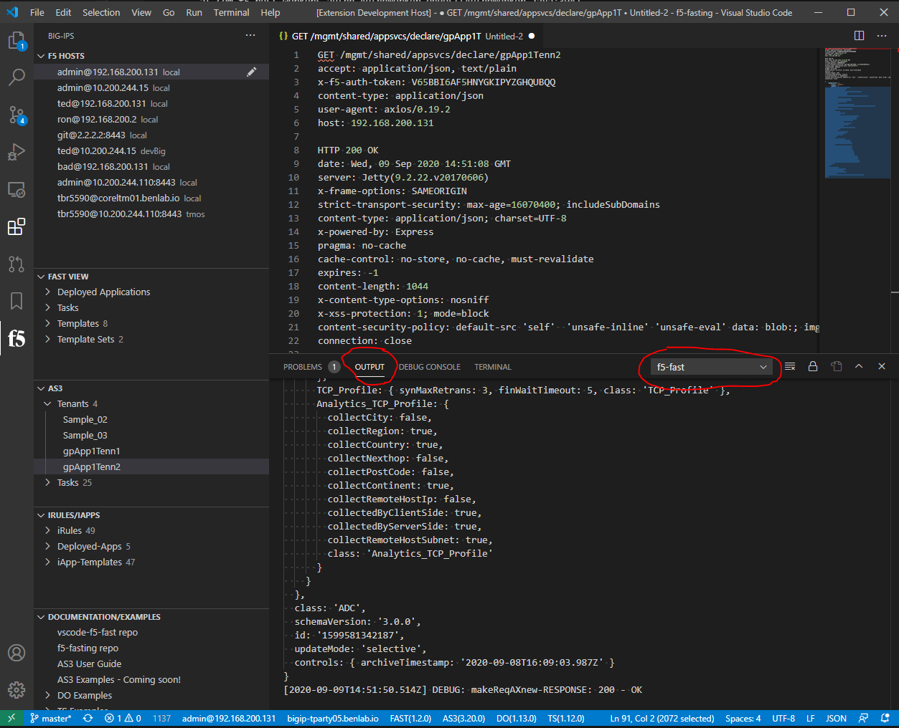
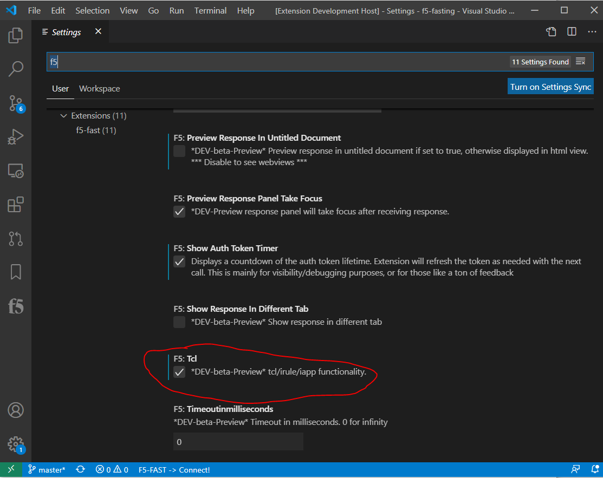

# General

## Basic device management 

### (add/edit/delete, connect/disconnect)

- To add a device
  - Add under the vscode extension settings
    - Press `F1`, type `f5`, select "F5: Settings", click add item button
        -- or --
  - Add device from the F5 HOSTS view
    - Click `F5: Add HOST` button in top right of the extension view for "F5 HOSTS"

- To Modify a device:
  - Modify under the vscode extension settings
    - Press `F1`, type `f5`, select "F5: Settings", click pencil icon next to item to modify
        -- or --
  - Modify device from the F5 HOSTS view
    - Click the pencil icon on the right of the host entry in the "F5 HOSTS" view

- To Delete a device:
  - Delete under the vscode extension settings
    - Press `F1`, type `f5`, select "F5: Settings", click "X" icon next to item to delete
        -- or --
  - Delete device from the F5 HOSTS view
    - 'Right-Click`, select "DELETE" from the menu that appears next to the host entry in the "F5 HOSTS" view

<!-- ## Device Mgmt (add, modify, delete devices) -->

---

## Connecting/Disconnecting and password caching

Connect means to select a device to work with.  When connected, commands/api calls will be executed on that device.

Passwords are cached automatically.  They can be cleared with the "F5: Disconnect and Clear ALL Passwords"

No need to disconnect when switching devices

If authentication to a device ever failes (401 response), password cache for that device will be cleared and prompt for a new one

*** passwords are cached using system encryption with KeyTar ***

- To connect to a device:
  - Select the device in the 'F5 Hosts' view on the left
    - -- or --
  - Press `F1`, type `f5`, select "F5: Connect to Device", select device from prompt

- To Disconnect from a device:
  - Click on the user@device object in the status bar at the bottom
    -  -- or --
  - Press `F1`, type `f5`, select "F5: Disconnect from Device"

## Authentication provider

Details about how to setup the authentication provider

## local vs tmos for BIGIP autProvider

When utilizing external auth provider on a regular BIG-IQ (not bigiq), regardless of what is set (local/tmos/radius/ldap/...), the auth provider to use that configured service should be local or tmos.  This bascially tells the api auth service on the f5 f5 to use whatever is configured for the device.  For bigiq, it must be set since the user can select which authentication service they want to use at login.

> Summary -> if your connecting to a bigip and getting 401 invalid logon provider, the two main options to try should be 'local' or 'tmos'.  In my testing, no other options worked.

## OUTPUT logging

As of the v2.3.0 most logs are now sent to the OUTPUT tab of the bottom pane.  This should provide easier access to what the extension is doing.

<!--  -->

## Settings

This extension contributes the following settings:

* `f5.hosts`: a list of f5 devices to connect to

Enable TCL functionality under `F5: Tcl`.  This is disabled by default (now enabled by default)

## Commands

Extension commands are access through the command palette by pressing `F1` or `cntrl+shift+p`

This extension provides the following commands and are active on workspace load (if extension is installed and enabled).

* `F5: Connect to Device`: Used to select a device from list to connect to
* `F5: Disconnect`: Disconnect from current device
* `F5: Disconnect and Clear All Passwords`: Disconnect from current device and clear ALL cached passwords
* `F5: Show Device Info`: Displays json output of F5 Host information, including platform/licensing/software/macAddresses/vlans
* `F5: Add Host`: Prompts to add a new host to the configured list
* `F5: Remote Command Execute`: Prompts for command to execute on device via BASH API (account must have advanced shell enabled)
* `F5: Settings`: Opens VS Code settings window focused on F5-Fast settings (currently only device list)

* `F5-Fast: Show Info`: Displays json output of F5-Fast service info
* `F5-Fast: Deploy Fast App`: Post editor or text selection as FAST application deployment parameters
* `F5-Fast: Convert json as3 to mst for templating`: Takes an as3 json file type and changes it to .mst file type for templating
* `F5-Fast: Post Template`: Posts current editor or text selection as a new single FAST template
* `F5-Fast: Post Template Set`: Posts folder/templates as a Fast template set
* `F5-Fast: Render HTML Preview`: Takes current editor or text selection and provide FAST HTML gui parameters preview

* `F5-AS3: Post Declaration`: Post entire active editor selected contents as AS3 declaration to selected device (can also select/highlight text)

* `F5-DO: Inspect`: Displays json output of the DO 'inspect' endpoint
* `F5-DO: Get Current Declaration`: Displays json output of the current declaration, if there is one
* `F5-DO: Get Tasks`: Displays json output of the task history
* `F5-DO: Post Declaration`: Post entire active editor contents as DO declaration to selected device (can also select/highlight text to be sent)

* `F5-TS: Show Info`: Displays json output of TS service info
* `F5-TS: Get Current Declaration`: Displays json output of the current declaration, if there is one
* `F5-TS: Post Declaration`: Post entire active editor contents as TS declaration to selected device (can also select/highlight text to be send)

* `F5: ChuckJoke`: When you need some inspiration...