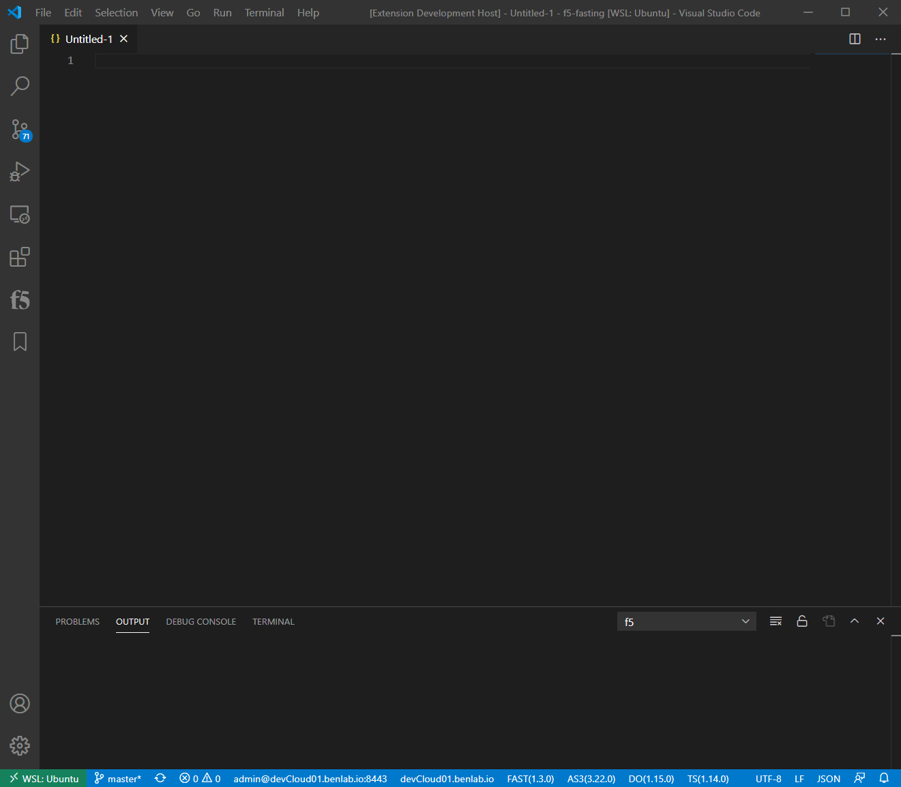
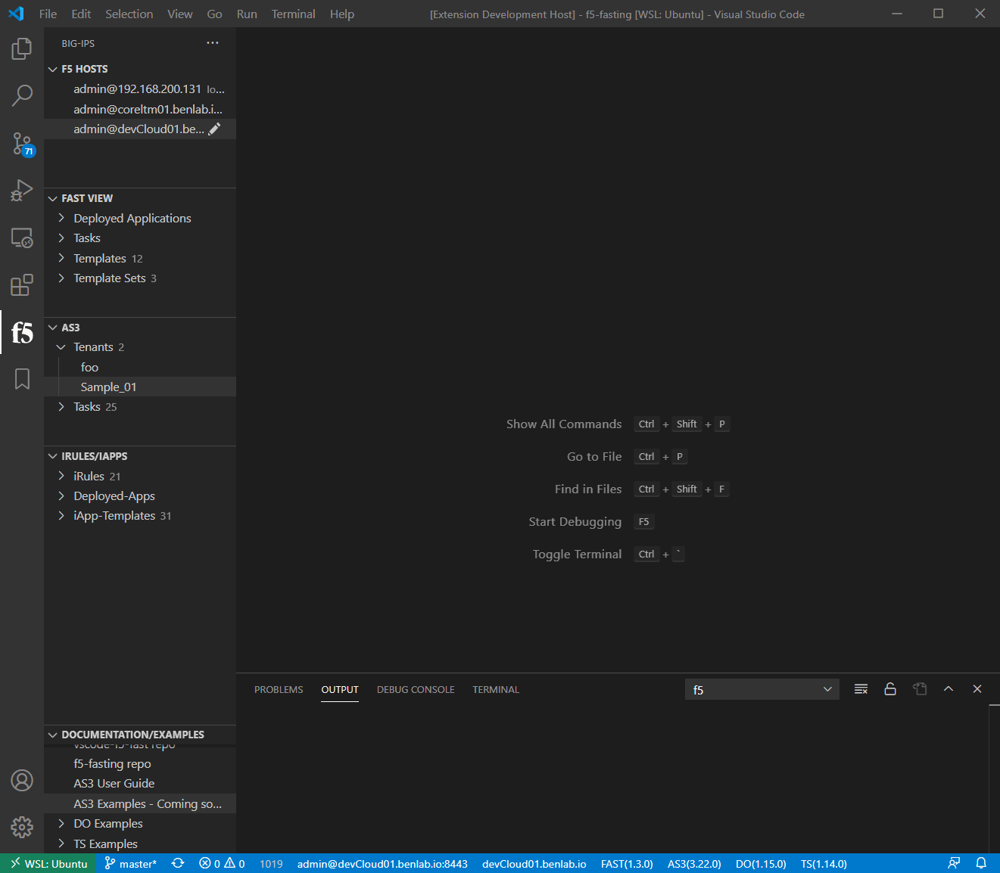
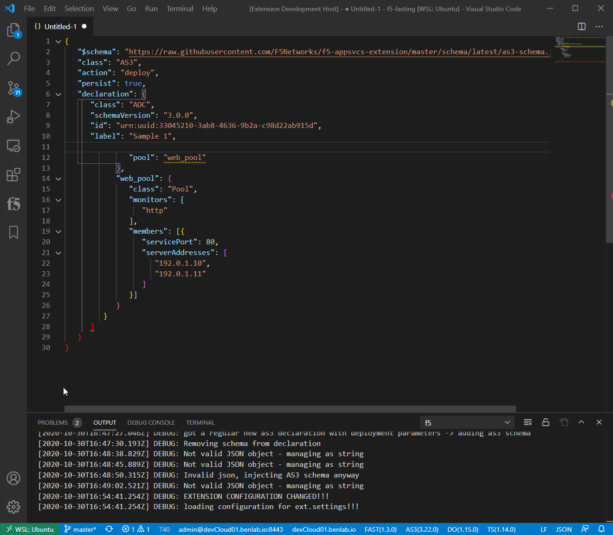

# Schama Validation

<!-- <p>&nbsp;</p> -->

One of the primary uses of this tool is to provide schema validation of the ATC declaration during the authoring process.  Understanding and having constant feedback about the declaration and it's content during development can drastically improve the expereince.

There is a schema for each of the different ATC services (AS3/DO/TS), these methods apply to all.  


> NOTE:  Schemas are versioned but are BACKWARD COMPATIBLE, meaning ***ALWAYS USE LATEST SCHEMA VERSION*** to validate any declaration


There are two main ways schema validation can be applied:

## Untitled document schema or in-declaration direct reference

Just as documented here: https://clouddocs.f5.com/products/extensions/f5-appsvcs-extension/latest/userguide/validate.html, the necessary json schema can be referenced diretly within the declaration.

This scenario is common when first starting out with automation since it is very easy to open an editor, copy an example declaration and start editing.  Since the file has not been saved (with the appropriate file type discussed later), VSCode does not know what schema to apply, therefore, just providing basic json syntax validation.  

The extension contains basics example declaration of AS3/DO/TS, each containing the respective schema.  This is a good place to quickly access access an example declaration with schema validation to get started.

[***See extension Snippets below***](/schema_validation#extension-snippets)

## Inject/Remove Schema Reference Command

There is a command to inject the appropriate schema reference into any editor declaration (mainly the untitled).

This commmand is easily accessable with a right click in an editor window, then selecting `Inject/Remove Schema Reference`.  This will read the declaration in the current active editor and attempt to inject the appropriate schema.  This is done by parsing the text into a json object, detecting the particular class parameters for each of the ATC services, adding the appropriate object schema reference, and updating all the text in the editor.

<!-- <p>&nbsp;</p> -->

### Removing and re-injecting schema to the as3 example declaration snippet



### Injecting schema into an as3 declaration when viewing a deployed as3 declaration



### Schema mgmt with invalid json

If invalid json is detected but a schema reference is found in the text, it will remove the schema reference

If invalid json is detected and no schema reference is found, it will present an option to add the desired schema at the top of the editor/text.  




---

<!-- <p>&nbsp;</p> -->

## File Type schema reference

<!-- <p>&nbsp;</p> -->

The other method of providing schema validation, and recommended method, is through file types.  A typical AS3/DO/TS declaration may be saved as a JSON (app1.json) file since that is the structure of the data. To follow on with this, the extension utilizes file sub-types to associate the appropriate schema.

- *.as3.json
- *.do.json
- *.ts.json

Examples can be found in the f5-fasting repo

<!-- <p>&nbsp;</p> -->

---

<!-- <p>&nbsp;</p> -->

## Extension Snippets

<!-- <p>&nbsp;</p> -->

Snippets are code blocks that are used to quickly insert code within an editor in VSCode.  The extension includes the basic example for each of the ATC services (AS3/DO/TS).  

To access the snippets, open an editor file, change the language to JSON, then start typing 'as3', 'do' or 'ts', the hit 'enter".  This should insert the example snippet for the respective ATC service. 

> NOTE:  these snippets include the direct schema reference


VSCode guide for defining customer user snippets
https://code.visualstudio.com/docs/editor/userdefinedsnippets

<!-- <p>&nbsp;</p> -->

---

<!-- <p>&nbsp;</p> -->

## Schema Links

<!-- <p>&nbsp;</p> -->

### Latest AS3 Schema
https://raw.githubusercontent.com/F5Networks/f5-appsvcs-extension/master/schema/latest/as3-schema.json

### Latest DO Schema
https://raw.githubusercontent.com/F5Networks/f5-declarative-onboarding/master/src/schema/latest/base.schema.json

### Latest TS Schema
https://raw.githubusercontent.com/F5Networks/f5-telemetry-streaming/master/src/schema/latest/base_schema.json

<!-- <p>&nbsp;</p> -->

---

<!-- <p>&nbsp;</p> -->

## Validating YAML ATC Declarations with JSON Schemas

<!-- <p>&nbsp;</p> -->

Install the RedHat YAML extension
https://marketplace.visualstudio.com/items?itemName=redhat.vscode-yaml


In the vscode settings for that extension:
<!-- <p>&nbsp;</p> -->

```json
    "yaml.schemas": {
        "https://raw.githubusercontent.com/F5Networks/f5-appsvcs-extension/master/schema/latest/as3-schema.json": ["*.as3.yml"],
        "https://raw.githubusercontent.com/F5Networks/f5-declarative-onboarding/master/src/schema/latest/base.schema.json": ["*.do.yml"],
        "https://raw.githubusercontent.com/F5Networks/f5-telemetry-streaming/master/src/schema/latest/base_schema.json": ["*.ts.yml"],
    }
```
<!-- <p>&nbsp;</p> -->

create a yaml file for as3 like: `as3Dec1.as3.yml `

