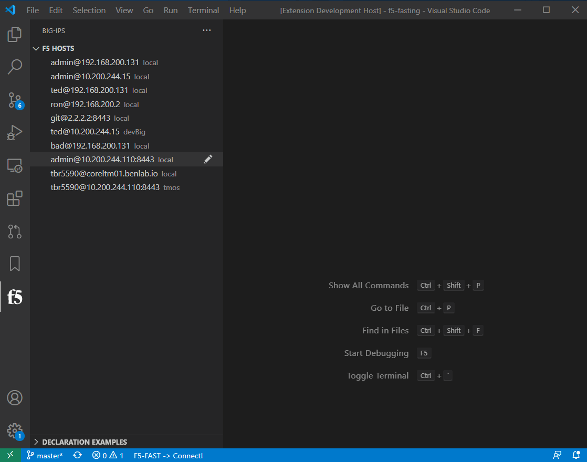

# TCL/iRules/iApps

This VSCode extension now supports the management of TCL/TMOS objects, including iRules/iApps.  iRules and iApps are listed/viewed via the API, but merged with the running config when uploaded/updated.  

This functionality can also be used for creating/modifying or migrating applictions

While this extension does help with the managment of iRules/iApps, it does not provide any validation or language features like syntax checking or auto-complete.  For language features, it is highly recommended to utilize the following extensions.

All these extension combined provide a very power platform for writing and deploying iRule/iApps.

!> NOTE:  Be cautious of editing iRules in a production environment since any changes can affect client connections.

## iRules

Recommended iRule language extension

https://marketplace.visualstudio.com/items?itemName=bitwisecook.irule

## iApps

Recommended iApp language extension

https://marketplace.visualstudio.com/items?itemName=bitwisecook.iapp

## Commands

* `F5: Merge TCL/TMOS`: Used to merge editor/highlighted text with running connfig of connected bigip
  - Use this to push a new TMOS config object or after modifing an existing irule (format is a tmos object)
  - Available: right-click in editor
  - Uploads a file with configuration objects, moves them to a temp directory, then attempts to merge with running config
    - /var/config/rest/downloads/tempTmosConfigMerge.tcl -> /tmp/tempTmosConfigMerge.tcl
    - `tmsh load sys config merge file /tmp/tempTmosConfigMerge.tcl`
    - If no error|fail detected -> pop-up success message
      - else display editor with full error message

* `F5: DELETE iRule`: Used to delete irule
  - Available: right-click irule item in TCL view tree
  - Deletes irule object from device, refreshes TCL tree view to show changes

* `F5: Get iApp Template Origin .tmpl`: Displays the original .tmpl iApp template format
  - Available: regular click on iApp item in IRULE/IAPPS view
  - Primary recommended method for modifying an iApp

* `F5: Get iApp Template JSON`: Displays the JSON format of selected iApp template
  - Available: right-click on iApp item in IRULE/IAPPS view
  - Don't really see any use for this, but it's there for show

* `F5: RE-DEPLOY iApp-App`: Redeploys iApp-App using current paramters
  - Available: right-click on Deployed-Apps item in IRULE/IAPPS view
  - Like issuing command:  modify sys application service my_app.app/my_app execute-action definition
  - This is used for redeploying an app after making changes to the source iapp template

* `F5: DELETE iApp-App`: Deletes iApp-App
  - Available: right-click on Deployed-Apps item in IRULE/IAPPS view tree

* `F5: DELETE iApp Template`: Deletes iApp Template
  - Available: right-click on iApp-Templates item in IRULES/IAPPS view tree

* `F5: POST iApp Template .tmpl`: Uploads and imports iApp template
  - Available: right-click in editor and right-click on explorer file with .tmpl extension

---

## Create/Modify/Delete iRule

&nbsp;

---

## iApp Template Management

* Upload .tmpl from explorer file
* Upload iApp from editor
* Modify existing iApp
* Delete iApp

&nbsp;

---

## Config Migration

The following workflow shows how an application can be extracted from a config and merged with the running config of another device

!> Be aware of configuration object parameters which are not user settable like the `last-modified-time` of the virtual server.  They will need to be removed before merge.

!> It is recommended to only merge configurations items that are sourced from the same TMOS version

