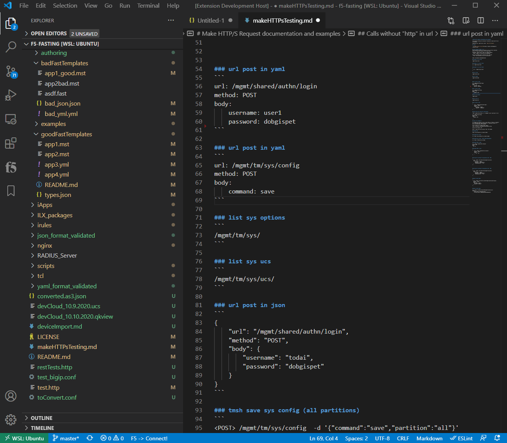

# Utilities

## JSON <-> YAML converter

There is a json <-> yaml converter via right-click in the editor as shown below:

## Base64 encode/decode

Right-click in an editor will also present the option to base64 encode/decode

## onConnect/onDisconnect Commands

Details about this configuraton option

## Remote Command Execute

Command to issue on the remote device.  Good for quickly getting information while building declarations!

