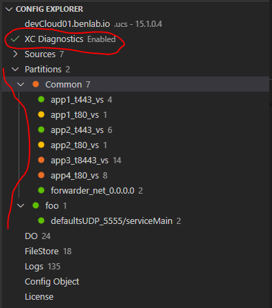
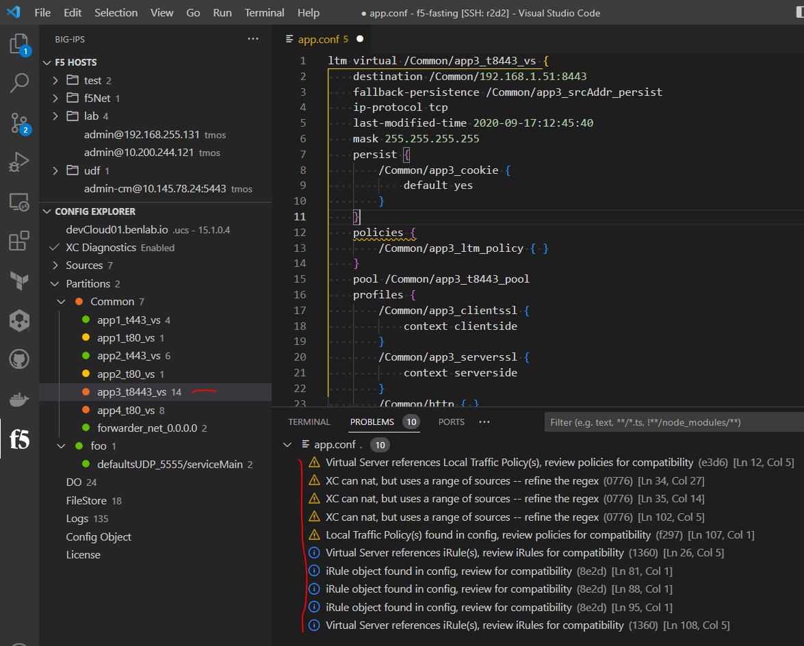
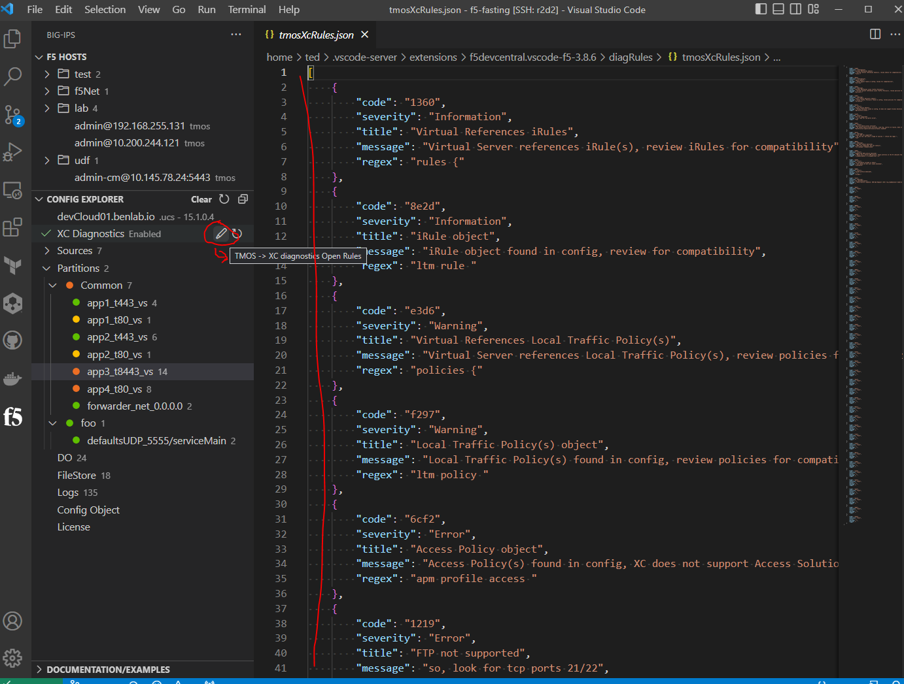

# TMOS -> XC Diagnostics

XC Diagnostics attempts to provide an easy go/no-go interface to understand what app can possibly be configured on F5 Distributed Cloud

## Getting started

XC Diagnostics are based on TMOS configs.  This diagnostic feedback is built around the F5 config explorer (f5-corkscrew) feature, which aids in exploring and abstracting applications from .conf/ucs/qkview files.

> To get started with [Config Explorer](config_explorer.md)

Then enable XC Diagnostics by clicking the button



From here, expand/click on different apps and watch the diagnostics update



## Rules

This tools was designed to be extensible, and therefore, the ruleset can easily be updated to accomodate different scenarios.

The rules can be access by clicking on the pencil icon in the "XC Diagnostics" view item.



### Rule Details

The following is a breakdown of the rule structure

|key | details |
| --- | --- |
| code | Four digit hex code unique to each rule; makes the rule easily referencable |
| severity | Error/Warning/Information/Hint shows the importance of each rule |
| title | Short title of the rule |
| message | Detailed rule body; can include markdown/links formatting |
| regex | Regex used to support the rule |


### Example

```json
    {
        "code": "e3d6",
        "severity": "Warning",
        "title": "Virtual References Local Traffic Policy(s)",
        "message": "Virtual Server references Local Traffic Policy(s), review policies for compatibility",
        "regex": "policies {"
    }
```

### Rules updates

Once the ruleset has been updated, save the file (cntrl+s), then click on the refresh icon in the XC Diagnostics view item used to enable diagnostics

That refresh icon will re-load that saved rule file into the workspace and re-apply the XC diagnostics.

### Providing feedback

Please open a github issue with any questions, new rules and/or updates

Issues
<https://github.com/f5devcentral/vscode-f5/issues>

Main ruleset file
(https://github.com/f5devcentral/vscode-f5/blob/main/diagRules/tmosXcRules.json)